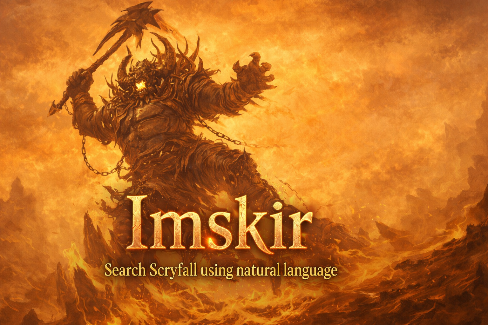

# Imskir - Natural Language Search for Scryfall

Imskir is a browser extension that lets you search [Scryfall](https://scryfall.com) using plain English instead of its complex query syntax. Type something like **"big red and green creatures with flying"** and the extension translates it into Scryfall's syntax (e.g. `c:rg t:creature pow>=4 o:flying`) before submitting.

## How It Works

1. **Content script** (`content.ts`) injects into Scryfall pages and intercepts the search form submission
2. Your natural language query is sent to the **background service worker** (`background.ts`), which calls an AI model to translate it into Scryfall syntax
3. The AI uses a built-in `scryfall-search` tool to fuzzy-match specific card names via the Scryfall API when needed
4. The translated query replaces your input and the form submits normally

A **conic-gradient glow ring** appears around the search box when the extension is active, and animates while a query is being translated.

## Configuration

Click the extension icon to open the **popup** (`popup.tsx`), where you can:

- **Toggle** the extension on/off
- **Choose an AI provider**: Anthropic, Google, or OpenAI
- **Enter your API key** for the selected provider
- **Set a model ID** (sensible defaults are provided):
  - Google: `gemini-flash-lite-latest`
  - Anthropic: `claude-sonnet-4-5-20250929`
  - OpenAI: `gpt-4o-mini`

All settings are stored in `chrome.storage.sync`.

## Tech Stack

- [Plasmo](https://docs.plasmo.com/) - Browser extension framework
- TypeScript + React - Popup UI
- [Vercel AI SDK](https://sdk.vercel.ai/) - Unified interface for multiple AI providers
- Zod - Schema validation for AI tool inputs

## Project Structure

```
├── background.ts   # Service worker: AI translation logic
├── content.ts      # Content script: DOM injection on scryfall.com
├── popup.tsx        # Popup UI: toggle, provider/key/model settings
├── syntax.md       # Full Scryfall search syntax reference
├── package.json    # Config, manifest overrides, dependencies
└── assets/
    └── icon.png    # Extension icon
```

## Getting Started

### Prerequisites

- Node.js
- pnpm
- An API key from Anthropic, Google, or OpenAI

### Development

```bash
pnpm install
pnpm dev
```

Load the extension from `build/chrome-mv3-dev/` in your browser's extension manager (enable Developer Mode).

### Production Build

```bash
pnpm build
```

Output is in `build/chrome-mv3-prod/`.

### Package for Store Submission

```bash
pnpm package
```

## Permissions

| Permission | Purpose |
|---|---|
| `storage` | Persist user settings (provider, API key, model, enabled state) |
| `host_permissions: scryfall.com` | Run the content script on Scryfall pages |
